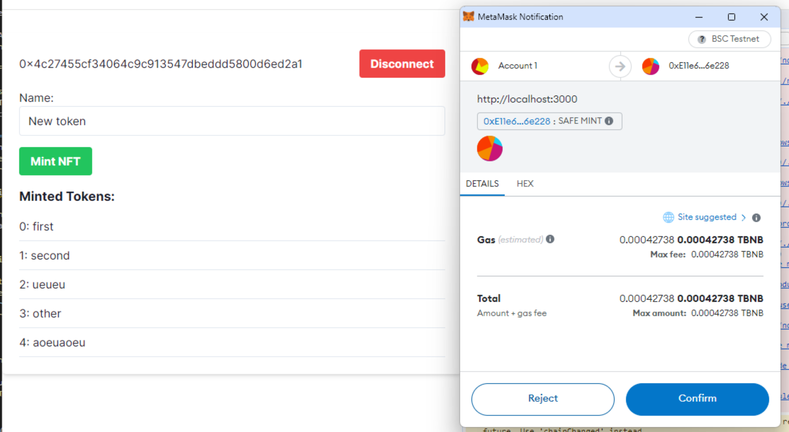

npm run dev

# Mint NFT Tokens and Display in List

I have achieved the goal I set for myself, which is to mint tokens and see them generated in a list. The most challenging part for me was truly understanding what web3 is and programming for it. My mistake was diving into programming without a clear idea of what I wanted to achieve. I should have researched from the beginning instead of jumping into coding.



I highly recommend the video that I should have watched from the start. It's from my favorite developer YouTuber, and he explains web3 very well.

[s Web3 all Hype? Top 10 Web 3.0 Questions & Answers](https://youtu.be/wHTcrmhskto)

I created a simple contract using Remix (`contracts/contract.sol`). Then, in Next.js, with the help of two hooks, `useWeb3Provider` and `useMintNFT`, I am able to mint new tokens with names and display them on the screen.

It has been a good challenge, and I've had the opportunity to learn technologies that were unfamiliar to me. Now, I am eager to create an app that displays images on IPFS.

```

```
